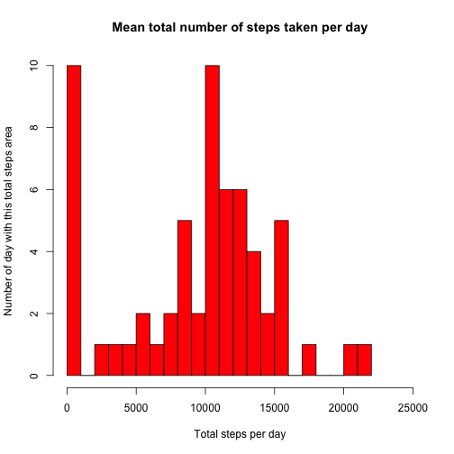
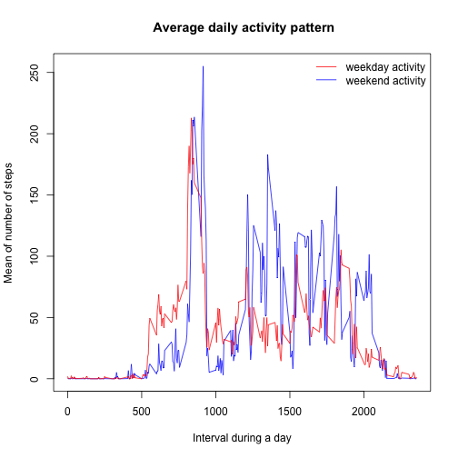

## Loading and preprocessing the data

```r
setwd("/Users/mac1/Desktop/DataCours")
activity= read.csv("activity.csv", header=TRUE, sep=',')
```

## What is mean total number of steps taken per day?
1. Make a histogram of the total number of steps taken each day

```r
StepByDay <-aggregate(list(meanSteps=activity$steps), list(date=activity$date), sum, na.rm=TRUE)
hist(StepByDay$meanSteps, breaks = 30, col = "red",border = "black", main="Mean total number of steps taken per day", xlab ="Total steps per day", ylab ="Number of day with this total steps area", xlim=c(0,25000))
```

 

2. Calculate mean and median total number of steps taken per day

```r
round(mean(StepByDay$meanSteps))
```

```
## [1] 9354
```

```r
round(median(StepByDay$meanSteps))
```

```
## [1] 10395
```

## What is the average daily activity pattern?
1. Make a time series plot

```r
StepsByInterval <- aggregate(list(meanSteps=activity$steps), list(interval=activity$interval), mean, na.rm=TRUE)
plot(StepsByInterval$meanSteps ~ StepsByInterval$interval  , col="black", main=" Average daily activity pattern", xlab='Interval during a day',  ylab="Mean of number of steps", type='l')
```

 

2. Which 5-minute interval, on average across all the days in the dataset, contains the maximum number of steps?

```r
StepsByInterval$interval[which.max(StepsByInterval$meanSteps)]
```

```
## [1] 835
```


## Imputing missing values
1. Calculate and report the total number of missing values in the dataset

```r
na_steps<-sum(is.na(activity$steps))
na_date<-sum(is.na(activity$date))
na_interval<-sum(is.na(activity$interval))
```

2. Devise a strategy for filling in all of the missing values in the dataset.  
During 61 days, corresponding to a significant sample, we can expect a repeat of values for a same intervals. 
The nearest behavior for an interval is that which corresponds to the average of the same interval for the other days.
So, we will fill the missing values in the dataset with  the mean for that 5-minute interval

3. Create a new dataset that is equal to the original dataset but with the missing data filled in.


```r
newactivity <- activity
l=length(newactivity[,1])
for(i in 1:l)
  { 
  if(is.na(newactivity$steps[i]))
    {
    newactivity$steps[i]<-StepsByInterval$meanSteps[StepsByInterval$interval==newactivity$interval[i]]
    }
  }
```

4.Make a histogram of the total number of steps taken each day

```r
NewStepByDay <-aggregate(list(meanSteps=newactivity$steps), list(date=newactivity$date), sum, na.rm=TRUE)
hist(NewStepByDay$meanSteps, breaks = 30, col = "red",border = "black", main="Mean total number of steps taken per day", xlab ="Total steps per day", ylab ="Number of day with this total steps area", xlim=c(0,25000))
```

 

5.Calculate and report the mean and median total number of steps taken per day.


```r
round(mean(NewStepByDay$meanSteps))
```

```
## [1] 10766
```

```r
round(median(NewStepByDay$meanSteps))
```

```
## [1] 10766
```

## Are there differences in activity patterns between weekdays and weekends?
1. Create a new factor variable in the dataset with two levels – “weekday” and “weekend” indicating whether a given date is a 


```r
newactivity$dateType<-as.POSIXlt(newactivity$date)$wday
l=length(newactivity[,1])
for(i in 1:l)
{ 
  if(newactivity$dateType[i]==0)
  {
    newactivity$weekend[i]<-"weekend"
  }
  
  if(newactivity$dateType[i]==6)
  {
    newactivity$weekend[i]<-"weekend"
  }
  
  else
  {
    newactivity$weekend[i]<-"weekday"
  }
  
}
```

2. Make a panel plot containing a time series plot


```r
StepsByWeekEnd <- aggregate(newactivity$steps ~ newactivity$weekend + newactivity$interval,newactivity, mean)
with(StepsByWeekEnd, {
  plot(StepsByWeekEnd[,3] ~ StepsByWeekEnd[,2], subset = StepsByWeekEnd[,1]== "weekend" , col="blue", main=" Average daily activity pattern", xlab='Interval during a day',  ylab="Mean of number of steps", type='l')
  legend("topright",  lty=1, col = c("red","blue"), legend = c("weekday activity", "weekend activity"), bty='n')
  lines(StepsByWeekEnd[,3] ~ StepsByWeekEnd[,2], subset = StepsByWeekEnd[,1]== "weekday" , col="red",  type='l')
   })
```

 
